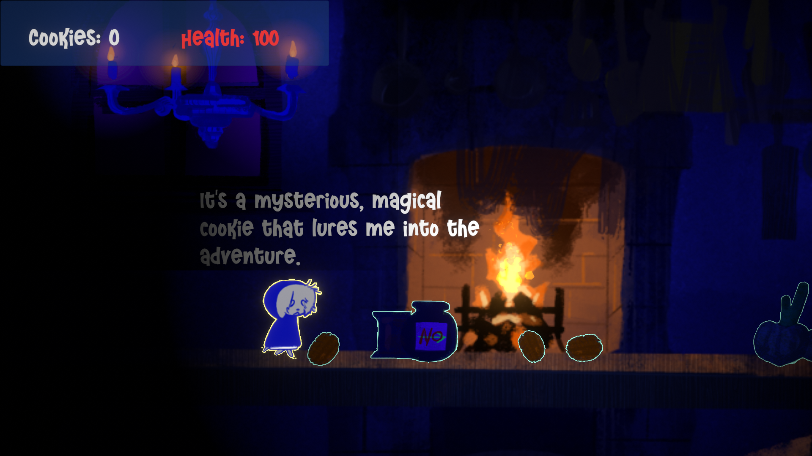
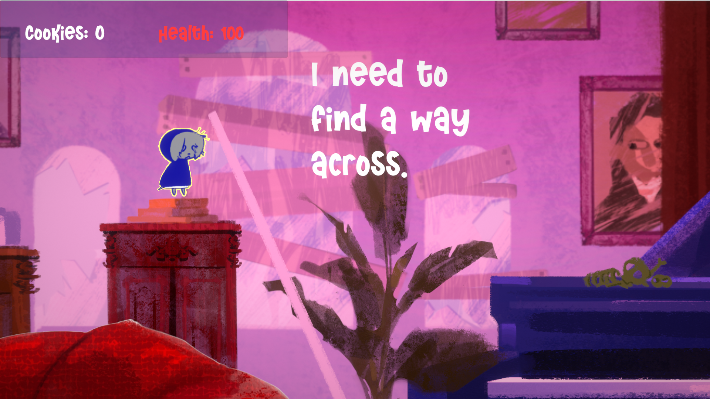
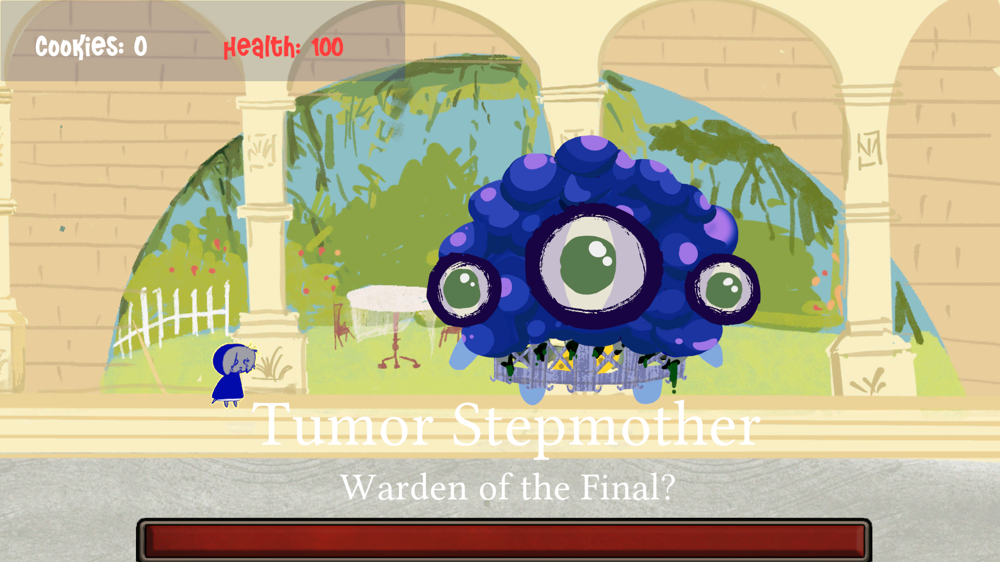

# GoldenBiscuit
 
 

🌐 [English README](./README.en.md)

2D横板冒险游戏，游玩时长约 **40 分钟**；为 **Brackey's Game Jam 2025** 制作，活动主题为Risk it for the biscuit。

踏上寻找金色饼干的冒险吧！

itch.io游戏页面：https://rosewang.itch.io/golden-biscuit  ||  👈🏻 **包含WebGL版本**，可直接游玩

## 技术栈 🛠️ 
Unity版本：2022.3.21f1c1

开发语言：C#

渲染管线：Built-In

输入：Input System + Input Manager

UI：UGUI

数据持久化：ScriptableObject

有使用的插件：DOTween、Cinemachine、Smart Lighting 2D

## 项目展示 💞
| 冒险 | 解谜 | 战斗 |
|------|------|------|
|  |  |  |

## 控制 👾
WASD 移动

左键 攻击

F 交互

E 吃饼干

## 开源许可 & 反馈 📜
本项目采用 [Apache-2.0 License](./LICENSE) 开源。

以及欢迎对项目提出反馈、提交 Issue 或 Pull Request！
